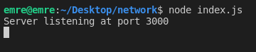

# Real-time Collaborative Text Editor

In today’s world there are many text or code editor programs exist. These applications offer theopportunity to display the texts or codes on the screen. These programs can be run online ina web browser or as a desktop application.  In this project Socket.io library is used to make areal-time collaborative code editor. Thus, workgroups can work together on the same code file atthe same time.

### Dependencies
       Node.js
       Socket.io npm files --> npm install soscket.io
       A browser
  
### How to execuate server?
Our project is an Node.js project so in normally you have to load node_modules files for dependencies. But when I load the files I uploaded node_modules files already so you don't need to install anything.

You can clone the github repository to run the project on your computer:
 
        git clone https://github.com/Emre81/network-programming
        
After the cloning process enter the project's folder from terminal screen and type the code below:
  
        node index.js
        
Now you can reach the server using browser with localhost:3000 address.    

